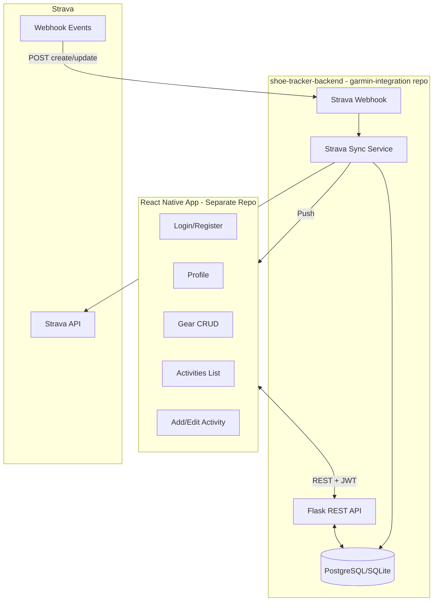

# Shoe / Gear Tracker App - Development Plan

## Overview

Build a gear mileage tracker with a Python backend in the garmin-integration repo (reusing FIT analyzers) and a separate React Native app. Users manage gear (shoes, bikes, components like chains/tires), log activities with per-gear usage, connect Strava for auto-import, and receive push notifications when new activities arrive. Shoes remain supported via a legacy API that delegates to the gear model.

## Architecture



---

## 1. Backend (New Subfolder in garmin-integration Repo)

**Location:** `garmin-integration/shoe-tracker-backend/`

### 1.1 Project Structure

```
shoe-tracker-backend/
├── src/
│   ├── api/
│   │   └── app.py              # Flask app, routes
│   ├── models/                 # SQLAlchemy or raw SQL
│   ├── services/
│   │   ├── strava_service.py   # OAuth, API calls, token refresh
│   │   └── webhook_handler.py  # Strava webhook processing
│   ├── strava_connector.py     # Strava API client
│   └── config.py
├── migrations/                 # Alembic or manual
├── requirements.txt
└── run.sh
```

### 1.2 Data Model

| Table                    | Key Fields                                                                                |
| ------------------------ | ----------------------------------------------------------------------------------------- |
| **users**                | id, email, password_hash, name, avatar_url, preferred_distance_unit (km/miles), created_at |
| **users_strava**         | user_id, strava_athlete_id, access_token, refresh_token, token_expires_at                 |
| **gear**                 | id, user_id, activity_type (run/bike/swim/other), gear_type (shoe/bike/component), brand, model, nick, metric_type (distance/hours/sessions), max_value, value_covered, is_default, status (active/retired), created_at |
| **gear_installations**   | id, child_gear_id, parent_gear_id, installed_at, removed_at (NULL = current)              |
| **activities**           | id, user_id, name, date, activity_type, total_distance_km, total_hours, total_sessions, source (manual \| strava), strava_activity_id |
| **activity_gear_usage**  | id, activity_id (nullable), gear_id, value (distance/hours/sessions per gear metric_type) |
| **gear_services**        | id, gear_id, name (user-defined), interval_value, interval_unit, early_warning_ratio, last_performed_value |
| **gear_service_logs**    | id, gear_service_id, performed_at, value_at_perform                                      |

**activity_gear_usage:**

- `activity_id` nullable: when `NULL` = manual adjustment on gear; when set = usage from that activity.
- `gear.value_covered` = `SUM(activity_gear_usage.value)` for that gear.
- Unique `(activity_id, gear_id)` when `activity_id IS NOT NULL`.

**Legacy shoes:**

- `/api/shoes` operates on `gear` where `gear_type='shoe'`. Existing shoes were migrated into gear.

**Reallocation when removing shoe/gear from activity:**

- **1 item remaining:** Backend auto-assigns full activity value. Client can omit `distance_km`/`value`.
- **2+ items:** API requires `distance_km`/`value` for each; sum must equal activity total.

### 1.3 API Endpoints

| Method | Endpoint                       | Auth | Purpose                                                                 |
| ------ | ------------------------------ | ---- | ----------------------------------------------------------------------- |
| POST   | /api/auth/register             | No   | Register user                                                           |
| POST   | /api/auth/login                | No   | Login, return JWT                                                       |
| POST   | /api/auth/forgot-password      | No   | Request reset                                                           |
| POST   | /api/auth/reset-password       | No   | Reset with token                                                        |
| GET    | /api/auth/me                   | Yes  | Current user                                                            |
| PUT    | /api/auth/profile              | Yes  | Update name, avatar, preferred_distance_unit (km/miles)                 |
| CRUD   | /api/shoes                     | Yes  | Legacy: list/create/update/delete shoes (operates on gear, gear_type=shoe) |
| PUT    | /api/shoes/:id/default         | Yes  | Mark shoe as default for running                                        |
| CRUD   | /api/gear                      | Yes  | List, create, update, delete gear (any type)                            |
| PUT    | /api/gear/:id/default          | Yes  | Mark gear as default for its activity_type                              |
| POST   | /api/gear/:id/installations    | Yes  | Attach component to parent (body: { parent_gear_id })                   |
| DELETE | /api/gear/:id/installations/:installation_id | Yes | Detach component (set removed_at)                        |
| CRUD   | /api/gear/:id/services         | Yes  | Manage service intervals (user-defined names)                           |
| POST   | /api/gear/:id/services/:sid/logs | Yes | Mark service as performed (updates last_performed_value)               |
| PUT    | /api/gear/:id/retire           | Yes  | Retire gear                                                             |
| GET    | /api/gear/alerts               | Yes  | Max value and service due/overdue alerts                                |
| CRUD   | /api/activities                | Yes  | List, create, update, delete activities                                 |
| GET    | /api/activities/:id            | Yes  | Activity detail with gear                                               |
| PUT    | /api/activities/:id/shoes      | Yes  | Legacy: add/edit/remove shoes (shoe_id = gear_id for shoe-type gear)    |
| PUT    | /api/activities/:id/gear       | Yes  | Assign gear to activity. Body: `[{ gear_id, value?, excluded_component_ids? }]`. Parent gear auto-includes installed components unless explicitly excluded. |
| GET    | /api/strava/connect            | Yes  | Return Strava OAuth URL                                                 |
| GET    | /api/strava/callback           | No   | OAuth callback, exchange code, store tokens                             |
| POST   | /api/strava/disconnect         | Yes  | Remove Strava link                                                      |
| GET    | /api/strava/status             | Yes  | Connected or not                                                        |
| POST   | /api/webhooks/strava           | No   | Strava webhook receiver (validate, respond 200, async process)          |

### 1.4 Strava Integration Flow

1. **Connect:** User taps "Connect Strava" -> redirect to Strava OAuth -> callback saves tokens and `strava_athlete_id` for user.
2. **Webhook subscription:** On first Strava connect, backend creates a single webhook subscription (one per app). Callback URL must be publicly reachable (ngrok for dev, real domain for prod).
3. **Webhook handler:** On `aspect_type=create`, `object_type=activity`:
   - Look up user by `owner_id` (Strava athlete ID).
   - Fetch activity via Strava API (`GET /activities/{object_id}`).
   - Map Strava `sport_type` to internal `activity_type`:
     - **run:** Run, VirtualRun, TrailRun, Treadmill (and types starting with "Run")
     - **bike:** Ride, VirtualRide, GravelRide, MountainBikeRide, EBikeRide
     - **swim:** Swim, PoolSwim, OpenWaterSwim
     - **other:** everything else
   - If activity is run, bike, or swim: create activity in DB with appropriate `activity_type`, assign default gear for that type, set distance/hours from Strava.
   - Enqueue push notification (Expo Push Token stored in users table).
   - Return 200 within 2 seconds; heavy work runs async.

### 1.5 Service Intervals

- Each `gear_services` row is a generic, user-defined service (e.g. "Chain cleaning", "Chain replacement").
- `gear.value_covered` always accumulates; `last_performed_value` is set when the user marks a service as complete.
- Warning when `distance_since_last_service >= interval_value * early_warning_ratio`; overdue when `>= interval_value`.
- User is warned on every activity until the service is marked complete.

### 1.6 Auth and Tech Choices

- **Auth:** JWT (access + optional refresh). Store user id in JWT.
- **Database:** SQLite for dev/simple deploy; PostgreSQL for production (env-switchable).
- **Password:** bcrypt for hashing. Reset flow: random token in DB, email link (or in-app deep link with token).

---

## 2. React Native App (Separate Repo)

**Location:** New repository (e.g. `shoe-tracker-app`)

### 2.1 Tech Stack

- **Expo** (managed workflow) for easier push notifications and OTA.
- **React Navigation** for screens.
- **AsyncStorage** for JWT.
- **Expo Notifications** for push (Expo Push Token sent to backend on login).
- **Deep linking:** `shoe-tracker://activity/:id/edit` for "open in edit" from notification.

### 2.2 Screens and Navigation

| Screen          | Route                | Purpose                                                                 |
| --------------- | -------------------- | ----------------------------------------------------------------------- |
| Login           | /login               | Email/password login                                                    |
| Register        | /register            | Email/password signup                                                   |
| Profile         | /profile             | Avatar, name, email, reset password, Strava connect, distance unit (km/miles) |
| Gear            | /gear                | List gear, add gear, edit gear (activity type, gear type, brand, model, nick, max value, service intervals) |
| Add Gear        | /gear/add            | Form for new gear (shoe, bike, component, etc.)                         |
| Activities      | /activities          | List activities, FAB "Add activity"                                     |
| Add Activity    | /activities/add      | Name, date, activity type, add parent gear, total distance/hours        |
| Activity Detail | /activities/:id      | View gear in activity (parent + components); tap to edit                |
| Edit Activity   | /activities/:id/edit | Add/remove parent gear, toggle component selection, edit values         |

### 2.3 Key UX Flows

**Add activity (manual):**

- Name, date picker, activity type (run/bike/swim/other), total distance/hours/sessions.
- Add parent gear (e.g. bike, running shoe). All installed components for that parent are **auto-selected** by default.
- User does not select child components explicitly; they are treated as selected unless the user unselects them.
- Default gear pre-selected with full value when applicable; user can add more gear and split.

**Edit activity (gear and components):**

- User sees parent gear with a list of its installed components. Each component has a toggle.
- **Selected (default):** component receives activity usage; `value_covered` increases.
- **Unselected:** component does not receive usage from this activity; no distance/value counted.
- When removing 1 of 2+ gear: validation and reallocation rules apply (sum must equal activity total).

**Edit gear (manual value):**

- User can manually set `value_covered` on gear. Stored as `activity_gear_usage` with `activity_id = NULL`.

**Add activity (from Strava):**

- Webhook creates activity with `activity_type` from Strava sport mapping, assigns default gear for that type.
- Push notification: "New {activity_type} from Strava: X km. Tap to edit gear."
- Tap opens `/activities/:id/edit` (via deep link).

**Profile:**

- Avatar (camera/gallery), name, email (read-only), "Reset password", "Connect Strava" / "Disconnect Strava", distance unit preference (km/miles).

---

## 3. Strava Webhook Setup

- **Callback URL:** Must be HTTPS and publicly reachable (e.g. `https://api.yourdomain.com/api/webhooks/strava`).
- **Verification:** On subscription create, Strava sends `GET callback_url?hub.challenge=X&hub.verify_token=Y`. Respond with `{"hub.challenge": "X"}` and 200.
- **Event handling:** Respond 200 immediately; process in background (queue or thread).

### 3.1 Strava OAuth App Setup

- Use [Strava Developers](https://developers.strava.com) to create a Connected App and copy the generated `Client ID`/`Client Secret`.
- Set the **Authorization Callback Domain** to your frontend host (for example `localhost:5173`) and add a redirect URI that points to the new UI page (`https://<frontend_url>/strava/oauth`). The React page parses the `code` and posts it to `/api/strava/callback`.
- Alternatively, Strava can redirect to a backend-only endpoint (e.g. `https://<backend_url>/api/strava/callback`) and that handler can immediately forward the user to the UI after exchanging the code.
- Choose a random `STRAVA_WEBHOOK_VERIFY_TOKEN` and register it with the webhook so the backend can validate incoming challenges.
- Optional: adjust `STRAVA_SCOPE` (defaults to `activity:read_all,activity:write`) if you need more granular permissions.

---

## 4. Implementation Order

### Phase 1: Backend Core

1. Create `shoe-tracker-backend/` structure, Flask app, config.
2. Implement users table, register/login, JWT auth.
3. Shoes CRUD, activities CRUD, activity_shoe_distance.
4. Profile endpoints (update name, avatar, reset password).

### Phase 2: Gear Extension (implemented)

1. Add gear schema (gear, activity_gear_usage, gear_installations, gear_services, gear_service_logs).
2. Migrate shoes → gear, activity_shoe_distance → activity_gear_usage.
3. Gear CRUD, installations, services, retire, alerts.
4. PUT /api/activities/:id/gear with auto-selection of components and excluded_component_ids.
5. Strava: multi-sport mapping (run/bike/swim), default gear per activity_type.
6. Profile: preferred_distance_unit (km/miles).
7. Shoes API delegates to gear (gear_type='shoe').

### Phase 3: React Native Core

1. Expo init, navigation, API client with JWT.
2. Login/register screens.
3. Profile screen (avatar, name, email, reset password, distance unit).
4. Gear list and add gear.
5. Activities list, add activity (manual), activity detail, edit activity (parent gear + component toggles).

### Phase 4: Strava

1. Strava OAuth (connect, callback, disconnect).
2. Strava connector service, token refresh.
3. Webhook endpoint (verify + handle create).
4. On activity create from Strava: map sport_type → activity_type, insert activity with default gear, enqueue push.

### Phase 5: Push Notifications

1. Expo Notifications setup in RN app.
2. Send Expo Push Token to backend on login; store in users.
3. Backend: on Strava activity import, send push via Expo API.
4. Deep link to activity edit screen.

---

## 5. Environment / Config

**Backend:**

- `DATABASE_URL` (SQLite path or Postgres URL)
- `JWT_SECRET`
- `STRAVA_CLIENT_ID`
- `STRAVA_CLIENT_SECRET`
- `STRAVA_REDIRECT_URI` (must match the redirect registered with Strava, e.g. `https://localhost:5173/strava/oauth`)
- `STRAVA_SCOPE` (optional, defaults to `activity:read_all,activity:write`)
- `STRAVA_WEBHOOK_VERIFY_TOKEN`
- `STRAVA_TOKEN_CACHE_PATH` (optional path to persist the token response; defaults to `backend/.strava_tokens.json`)
- `BACKEND_URL` (used when the frontend or webhooks need to resolve the backend base)
- `STRAVA_FRONTEND_REDIRECT_URL` (where GET callbacks should land after exchanging tokens, e.g. `https://localhost:5173/strava/oauth`)

**React Native:**

- `EXPO_PUBLIC_API_URL` (backend base URL)

---

## 6. Notes

- **activity_gear_usage:** All gear usage is stored in this table. Rows with `activity_id` set come from activities; rows with `activity_id = NULL` are manual adjustments. Gear `value_covered` is computed as the sum of all rows for that gear (distance/hours/sessions depending on `gear.metric_type`).
- **Component selection:** User does not explicitly select child components when adding parent gear to an activity. All installed components are auto-selected. User can unselect specific components; unselected components do not receive usage from that activity.
- **Legacy shoes:** `/api/shoes` and `/api/activities/:id/shoes` operate on gear (gear_type='shoe') for backward compatibility.
- Strava API: activity summary (distance, type, name, date) is used for auto-import. Sport mapping supports run, bike, swim.
- One Strava webhook subscription per app covers all connected users.
- Rate limits: Strava 200 req/15min, 2000/day; batch or defer non-critical calls.
