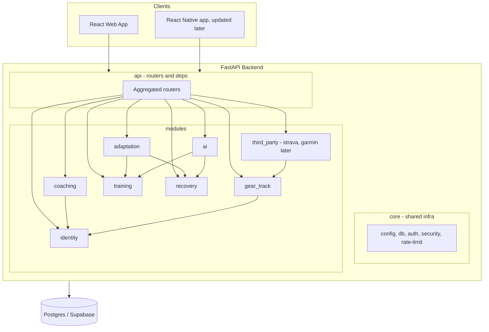

## Hard Constraint: Don't Break the Existing React Native App

The existing mobile client must keep working unchanged throughout every phase. Concretely:

- **All current URLs stay the same** — every `/api/auth/*`, `/api/strava/*`, `/api/webhooks/strava`, `/api/shoes/*`, `/api/gear/*`, `/api/activities/*`, `/api/health` route from [src/api/app.py](src/api/app.py) keeps the same path, HTTP method, and response shape.
- **Request/response payloads stay byte-compatible** — Pydantic response models must serialize to the same JSON the mobile app reads today (same field names, types, nulls, casing, `success`/`error` envelopes).
- **Auth stays compatible** — same JWT secret, claim shape, lifetime, and `Authorization: Bearer ...` header contract; existing tokens issued before the cutover must keep validating.
- **Strava OAuth flow stays compatible** — `STRAVA_FRONTEND_REDIRECT_URL` (e.g. `shoe-tracker://strava/callback`), state encoding, and `GET`/`POST /api/strava/callback` behavior preserved.
- **Database is shared and unchanged at cutover** — no destructive migrations in Phases 0–2; new tables for coach-app modules are added in Phase 3 and don't touch existing ones.
- **Deploy is a drop-in swap** — gunicorn-Flask -> uvicorn-FastAPI behind the same public URL/port; one production deploy switches over without a mobile app update.
- **CORS** — existing `FRONTEND_WEB_ORIGIN` behavior preserved; new web frontend origin is just added to the allow-list.
- **Regression safety net** — before Phase 2 cutover, capture the current API contract (route inventory + a small set of recorded request/response fixtures from real mobile flows) and run them against the FastAPI build as a smoke test. Keep the Flask app runnable on a side branch until the FastAPI build passes those fixtures.

## Goals

1. Turn this repo into a monorepo: `backend/` (FastAPI) + `frontend/` (React) + shared `docs/`, `docker/`.
2. Adopt a clear module layout on the backend where each module owns its own router, Pydantic schemas, service, and ORM models. Routes only validate + delegate; all logic lives in services.
3. Migrate the existing code unchanged in behavior, but in new homes:
   - Strava (`src/services/strava_service.py`, `webhook_handler.py`, `strava_webhook_subscription.py`, `src/strava_client.py`, Strava routes in `src/api/app.py`) -> `modules/third_party/strava/`.
   - Everything else from the current app (auth, user, gear, activities, services/logs) -> `modules/identity/` and `modules/gear_track/`.
4. Add new domain modules required by [docs/COACH_APP_TECH_SPEC.md](docs/COACH_APP_TECH_SPEC.md): coaching relations, training planning, recovery, adaptation engine, AI layer.
5. Stand up a React (Vite + TypeScript) web app with coach + athlete dashboards consuming the FastAPI backend.

## Target Repo Layout

```
gear-track/                       (repo name unchanged for now)
├── backend/
│   ├── src/
│   │   ├── core/                 # config, db session, auth/jwt, security, errors, rate-limit, crypto
│   │   ├── modules/
│   │   │   ├── identity/         # users, auth, profile, password reset
│   │   │   ├── gear_track/       # gear, activities, gear services/logs (the current shoe-tracker domain)
│   │   │   ├── third_party/
│   │   │   │   └── strava/       # OAuth, client, webhook handler, subscription script
│   │   │   ├── coaching/         # CoachAthleteRelation, invitations, permissions
│   │   │   ├── training/         # Macrocycle, Mesocycle, Microcycle, Workout, WorkoutStep
│   │   │   ├── recovery/         # RecoveryEntry, readiness scoring
│   │   │   ├── adaptation/       # adaptation engine (rules over recovery + plan)
│   │   │   └── ai/               # AIConversation + assistant orchestration
│   │   ├── api/                  # FastAPI app factory + router aggregation, dependency wiring
│   │   └── main.py               # uvicorn entry
│   ├── migrations/               # Alembic (moved from project root)
│   ├── tests/
│   ├── pyproject.toml            # replaces requirements.txt
│   └── Dockerfile
├── frontend/
│   ├── src/
│   │   ├── app/                  # router, providers, layout shells
│   │   ├── modules/
│   │   │   ├── auth/
│   │   │   ├── athlete/          # athlete dashboard (today workout, readiness, calendar, recovery input, AI chat)
│   │   │   ├── coach/            # coach dashboard (athletes overview, readiness monitor, plan/workout editors, AI)
│   │   │   ├── gear/             # existing shoe/gear UI surfaces, reused
│   │   │   └── shared/           # design system, hooks, api client
│   │   └── main.tsx
│   ├── package.json
│   ├── vite.config.ts
│   └── Dockerfile
├── docs/
├── docker-compose.yml            # db + backend + frontend
└── README.md
```

### Per-module backend convention

Each `modules/<name>/` folder contains:

- `router.py` — FastAPI `APIRouter`; handlers do request validation (via Pydantic) and call the service. No SQL, no business rules.
- `schemas.py` — Pydantic request/response models.
- `service.py` — business logic; takes a DB session and other services via constructor / FastAPI deps.
- `models.py` — SQLAlchemy ORM models owned by this module.
- `deps.py` — FastAPI dependency providers (e.g. `get_service`, `require_coach_for_athlete`).
- `__init__.py` — exports the router and public schema types.

Cross-module use happens through services only (e.g. `gear_track.service.GearService` consumed by `training/` if needed), never via shared globals.

## High-level Architecture



## Phased Rollout

Done in order; each phase is independently shippable and keeps the existing API working.

- **Phase 0 — Repo reorganization (mechanical, no logic changes).**
  Move current code into `backend/`, add empty `frontend/` skeleton, update `Dockerfile`, `docker-compose.yml`, `alembic.ini`, `run.sh`, `scripts/` paths. CI / deploy still points at the same FastAPI-replacement-of-Flask URL once Phase 1 lands.

- **Phase 1 — FastAPI foundation + `core/` extraction.**
  Stand up the FastAPI app factory, move `src/config.py`, `src/auth.py`, `src/rate_limit.py`, `src/crypto_utils.py`, `src/api/validation.py` into `backend/src/core/`. Establish the module template (router/schemas/service/models). Keep Flask running in parallel until Phase 2 finishes.

- **Phase 2 — Carve existing code into `identity/`, `gear_track/`, `third_party/strava/`.**
  - `identity/` <- the 7 `/api/auth/*` and `/api/auth/profile` routes from [src/api/app.py](src/api/app.py), plus the `User` model.
  - `gear_track/` <- all `/api/shoes/*`, `/api/gear/*`, `/api/activities/*`, `/api/gear/alerts` routes, plus models `Activity`, `Gear`, `GearInstallation`, `GearService`, `GearServiceLog`, `ActivityGearUsage` from [src/models/models.py](src/models/models.py), and `src/fit_reader.py`.
  - `third_party/strava/` <- all `/api/strava/*` and `/api/webhooks/strava` routes, `UserStrava` model, `src/services/strava_service.py`, `webhook_handler.py`, `strava_webhook_subscription.py`, `src/strava_client.py`, and `scripts/subscribe_strava.py`.
    Each route is rewritten as `router -> service` (logic extracted from the current ~1,400-line `app.py` into per-module `service.py`). Per the hard constraint above: URLs, HTTP methods, JSON shapes (`success`/`error` envelopes, field names, nulls), JWT contract, and Strava OAuth/webhook behavior stay byte-compatible so the existing mobile app keeps working. Verified by replaying the recorded request/response fixtures against the FastAPI build before cutover.

- **Phase 3 — Scaffold empty folders for coach-app modules (no logic).**
  Create the directory structure only, so the architecture is visible and ready to be filled in later. No models, no routes, no services, no migrations. Each module folder gets an empty `__init__.py` and a short `README.md` describing its responsibility per [docs/COACH_APP_TECH_SPEC.md](docs/COACH_APP_TECH_SPEC.md). Folders to create under `backend/src/modules/`:
  - `coaching/`
  - `training/`
  - `recovery/`
  - `adaptation/`
  - `ai/`
    Implementation of these modules (models, CRUD, business logic) is intentionally deferred to follow-up plans.

- **Phase 4 — Frontend (Vite + React + TS).**
  Single web app with auth flow, role-aware shell, and two dashboard areas: athlete (today workout, readiness, calendar, recovery input, AI chat) and coach (athletes overview, readiness monitor, plan/workout editors, AI). Reuses the same REST API the mobile app uses.

- **Phase 5 — DevOps polish.**
  `docker-compose` for `db + backend + frontend`, single `make`/`task` runner, README updates, env files split for backend vs frontend.

## Notes and Deliberate Non-decisions (to revisit later)

- Database: one shared Postgres database, one Alembic migration tree under `backend/migrations/`. Modules don't own separate schemas in MVP; we can introduce schemas per module later if it becomes useful.
- Auth/roles: keep a single `User` table with a role flag (or many-to-many `user_roles`) per the spec's "a single user may have both roles in future". Final shape decided in Phase 3.
- AI provider, FIT parsing pipeline, and webhook delivery to the new training/recovery modules: out of scope of this restructure; addressed in their own follow-up plans.
- Renaming the repo / Python package away from `gear-track` / `shoe_tracker` naming: deferred — the new top-level platform name can be applied as a rename once the structure settles.
